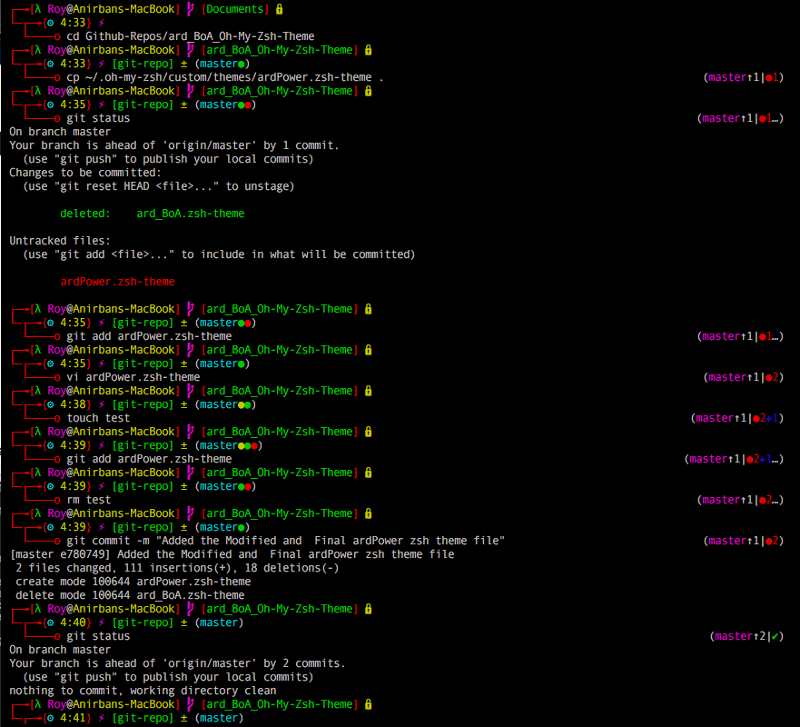

.. ardPower documentation master file, created by
   sphinx-quickstart on Sun May  8 11:28:54 2016.
   You can adapt this file completely to your liking, but it should at least
   contain the root `toctree` directive.

=====================================  
 Welcome to ardPower's Documentation!
=====================================

Introduction
-------------

Its a custom ``Oh-My-Zsh`` Theme inspired by many custom themes suited for a perfect ZSH Environment under Byobu with Tmux Backend.

Screenshot
-----------

   

Documentaion
--------------

.. toctree::
   :maxdepth: 2

   overview
   installation
   usage

Indices and tables
-------------------

* :ref:`genindex`
* :ref:`modindex`
* :ref:`search`

